# Budget Buddy — Frontend Application


This repository houses the frontend application for **Budget Buddy**, a comprehensive personal finance management tool. Built with React and styled with Tailwind CSS, it provides an intuitive interface for users to track their expenses, manage budgets, categorize transactions, and gain insights into their financial health.

## Table of Contents

-   [Key Features & Benefits](#key-features--benefits)
-   [Technologies Used](#technologies-used)
-   [Prerequisites & Dependencies](#prerequisites--dependencies)
-   [Installation & Setup Instructions](#installation--setup-instructions)
-   [Usage Examples & Backend Interaction](#usage-examples--backend-interaction)
-   [📸 Screenshots](#-screenshots)
-   [Configuration Options](#configuration-options)
-   [Project Structure](#project-structure)
-   [Contributing Guidelines](#contributing-guidelines)
-   [License Information](#license-information)
-   [Acknowledgments](#acknowledgments)

## Key Features & Benefits

Budget Buddy Frontend offers a seamless experience for managing your finances:

*   **Intuitive Dashboard:** Get a quick overview of your financial status, upcoming bills, and spending habits.
*   **Expense & Income Tracking:** Easily record and categorize all your financial transactions, differentiating between expenses and income.
*   **Budget Management:** Create and monitor budgets for various categories, helping you stay within your financial limits.
*   **Category Management:** Full control over transaction categories, including adding new ones, editing existing ones, and even assigning emojis for better visual organization.
*   **User Profile Management:** Update your personal information, including profile photo uploads, for a personalized experience.
*   **Responsive Design:** Built with Tailwind CSS, ensuring a consistent and optimal user experience across all devices (desktop, tablet, mobile).
*   **Real-time Feedback:** Utilizes `react-hot-toast` to provide instant, non-intrusive feedback for user actions and system notifications.
*   **Modular Component Architecture:** A well-organized and scalable codebase using React components, making it easy to understand, maintain, and extend.

## Technologies Used

The Budget Buddy frontend is built with modern web technologies:

### Languages

*   **JavaScript**: The primary programming language for the application logic.

### Frameworks & Libraries

*   **React**: A powerful JavaScript library for building user interfaces.
*   **Vite**: A next-generation frontend tooling that provides an extremely fast development experience.
*   **Tailwind CSS**: A utility-first CSS framework for rapidly building custom designs.
*   **Axios**: A promise-based HTTP client for making API requests.
*   **Emoji Picker React**: For adding interactive emoji selection.
*   **Lucide React**: A beautiful, open-source icon library.
*   **Moment.js**: For parsing, validating, manipulating, and formatting dates.
*   **React Hot Toast**: For simple and beautiful notifications.
*   **React Router Dom**: For declarative routing in React applications.

### Tools & Development Environment

*   **Node.js**: JavaScript runtime environment.
*   **ESLint**: For maintaining code quality and consistency.

## Prerequisites & Dependencies

Before you begin, ensure you have the following installed on your system:

*   **Node.js**: [LTS version recommended](https://nodejs.org/en/download/)
*   **npm** or **Yarn**: A package manager (npm comes bundled with Node.js).

## Installation & Setup Instructions

Follow these steps to get the Budget Buddy frontend application up and running on your local machine:

1.  **Clone the Repository**

    ```bash
    git clone https://github.com/SalemNabeelSalem/budget-buddy-application-frontend.git
    cd budget-buddy-application-frontend
    ```

2.  **Install Dependencies**

    Install all the required project dependencies using npm or Yarn:

    ```bash
    npm install
    # or if you use Yarn
    # yarn install
    ```

   3.  **Environment Configuration**

       This project uses environment variables, typically for API endpoints or other sensitive settings.

       *   Create a `.env` file in the root directory of the project by copying the example:

           ```bash
           cp .env.example .env
           ```
       *   Open the newly created `.env` file and configure your variables. A crucial variable will likely be the backend API base URL:

           ```dotenv
           VITE_APP_API_BASE_URL="http://localhost:5000/api" # Replace with your backend API URL
           VITE_CLOUDINARY_CLOUD_NAME={your_cloudinary_cloud_name} # If using Cloudinary for image uploads
           VITE_CLOUDINARY_UPLOAD_PRESET={your_cloudinary_upload_preset} # If using Cloudinary for image uploads
           ```
           ```
           **Note**: Ensure your backend server is running and accessible at the specified URL.

4.  **Run the Development Server**

    Start the application in development mode:

    ```bash
    npm run dev
    ```

    The application will typically be available at `http://localhost:5173` (or another port if 5173 is in use). Your browser should automatically open to this address.

5.  **Build for Production (Optional)**

    To create an optimized production build of the application:

    ```bash
    npm run build
    ```

    This command compiles the application into static files in the `dist/` directory, ready for deployment.

6.  **Preview Production Build (Optional)**

    To locally preview the production build:

    ```bash
    npm run preview
    ```

## Usage Examples & Backend Interaction

Once the application is running, users can interact with Budget Buddy through their web browser.

*   **General Usage Flow**:
    1.  **Registration/Login**: Users can sign up for a new account or log in with existing credentials.
    2.  **Dashboard Access**: Upon successful login, users are directed to their personalized dashboard, offering a summary of their financial data.
    3.  **Navigation**: Users can navigate through different sections like "Transactions," "Budgets," "Categories," and "Profile" using the application's sidebar or navigation menus.
    4.  **Data Entry**:
        *   **Adding a Transaction**: Navigate to the "Add Transaction" section, input details such as amount, description, category, and date.
        *   **Managing Categories**: Access the "Categories" section to add new categories (with optional emoji icons), edit existing ones, or delete them.
        *   **Updating Profile**: Go to the "Profile" section to change user details or upload a new profile picture.

*   **Backend Interaction**:
    This frontend application is designed to interact with a separate backend API to fetch, create, update, and delete financial data. All data persistence and business logic are handled by the backend.
    *   **API Calls**: `axios` is used throughout the application to make HTTP requests to the `VITE_APP_API_BASE_URL` defined in your `.env` file.
    *   **Data Flow**: User actions on the frontend trigger API calls to the backend. The backend processes these requests, interacts with the database, and sends back responses which the frontend then renders to the user.

## 📸 Screenshots

The following UI previews highlight the full user flow, from authentication to transaction management and filtering.

### Authentication

<p align="center">
  
  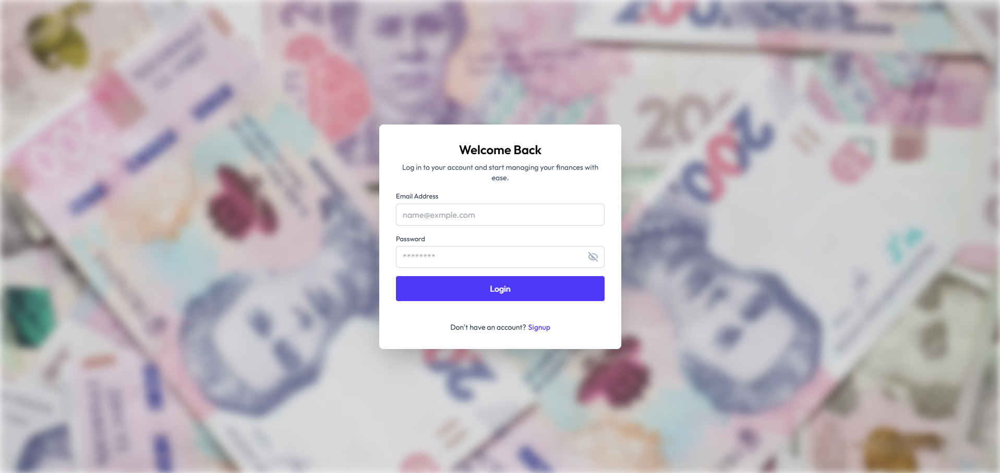
</p>
<p align="center">
  <sub><strong>Left:</strong> Sign Up page - create a new Budget Buddy account.</sub><br/>
  <sub><strong>Right:</strong> Login page - sign in with existing credentials.</sub>
</p>

### Dashboard

<p align="center">
  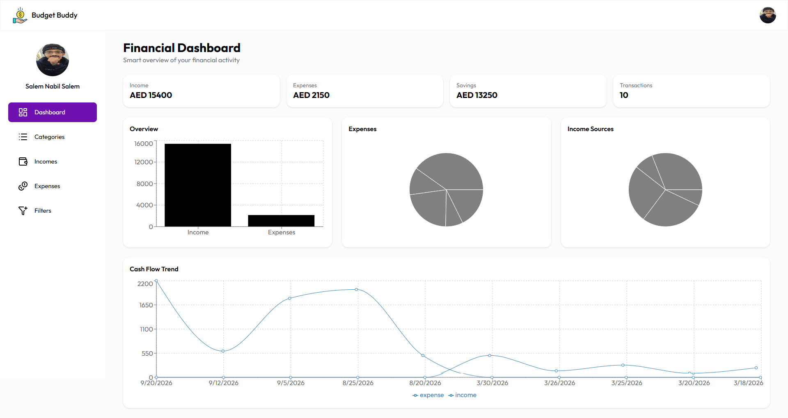
</p>
<p align="center">
  <sub>Main dashboard with key summaries and financial insights.</sub>
</p>

### Category Management

<p align="center">
  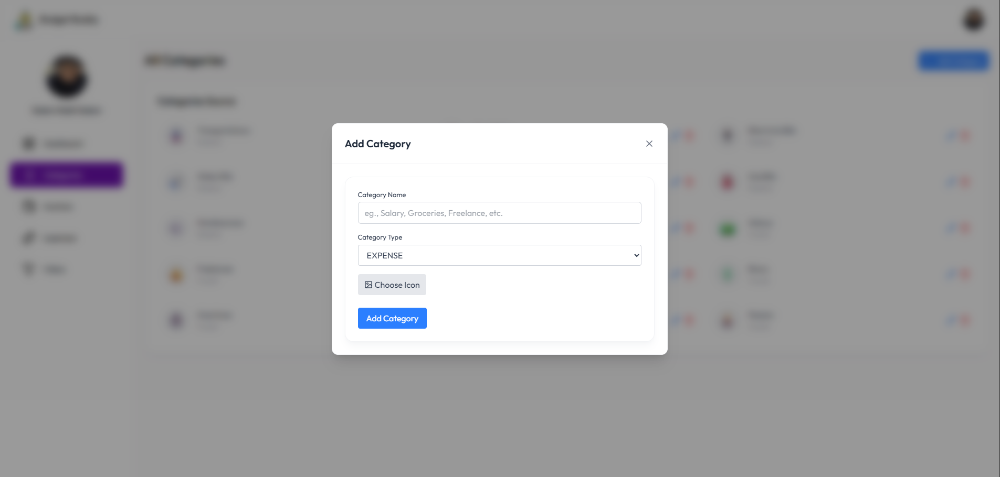
  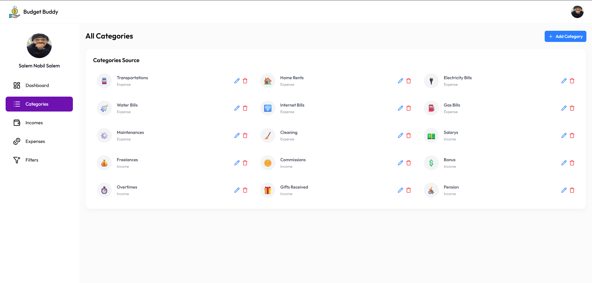
</p>
<p align="center">
  <sub><strong>Left:</strong> Add new category form with emoji picker support.</sub><br/>
  <sub><strong>Right:</strong> Categories page for browsing and managing category records.</sub>
</p>

<p align="center">
  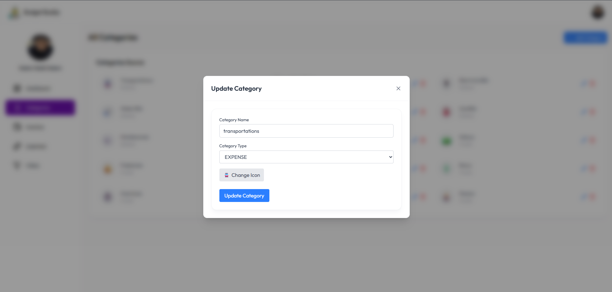
</p>
<p align="center">
  <sub>Update existing category form for quick category edits.</sub>
</p>

### Income Management

<p align="center">
  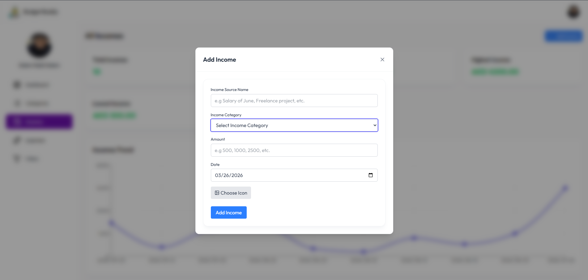
  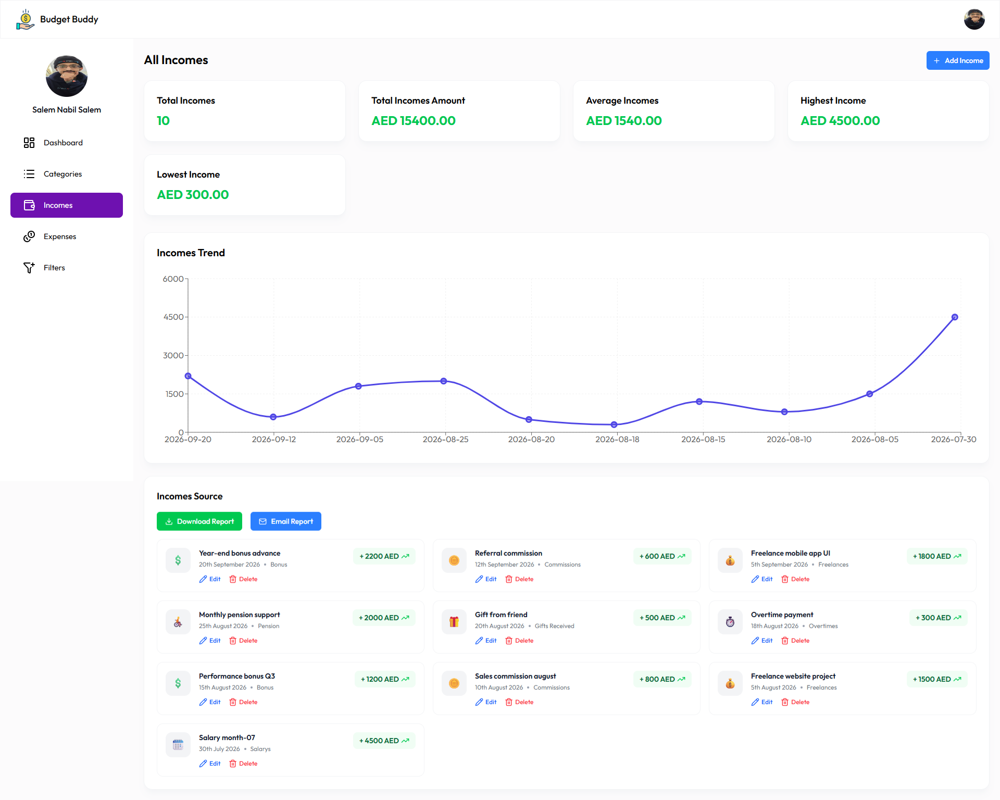
</p>
<p align="center">
  <sub><strong>Left:</strong> Add new income transaction.</sub><br/>
  <sub><strong>Right:</strong> Incomes list page with transaction overview.</sub>
</p>

<p align="center">
  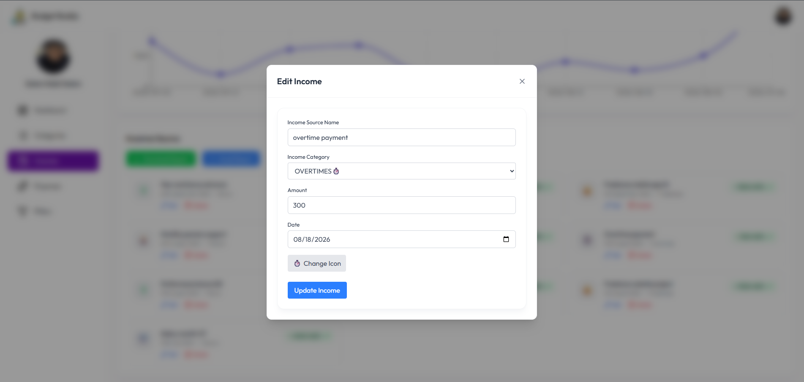
</p>
<p align="center">
  <sub>Update existing income form with editable transaction fields.</sub>
</p>

### Expense Management

<p align="center">
  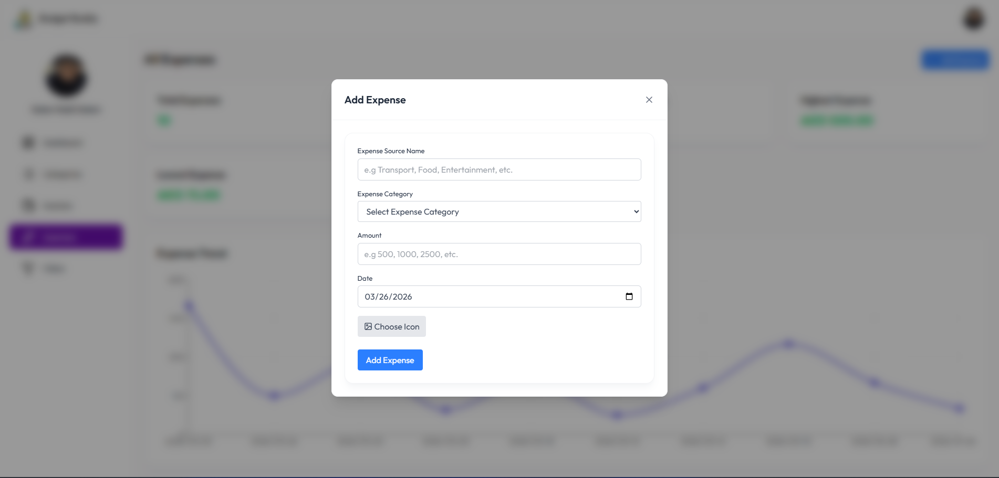
  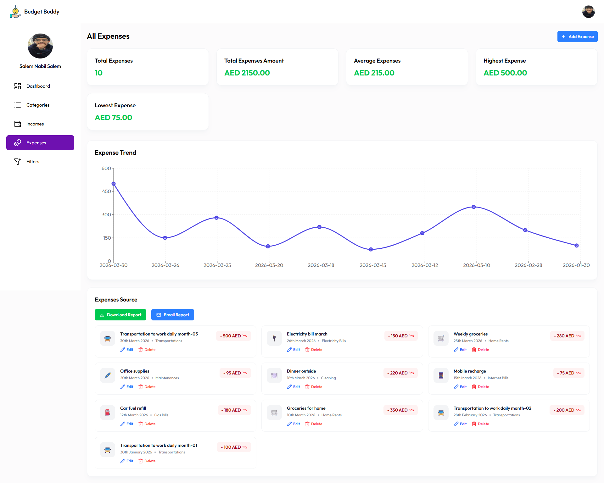
</p>
<p align="center">
  <sub><strong>Left:</strong> Add new expense transaction.</sub><br/>
  <sub><strong>Right:</strong> Expenses list page with reporting actions.</sub>
</p>

<p align="center">
  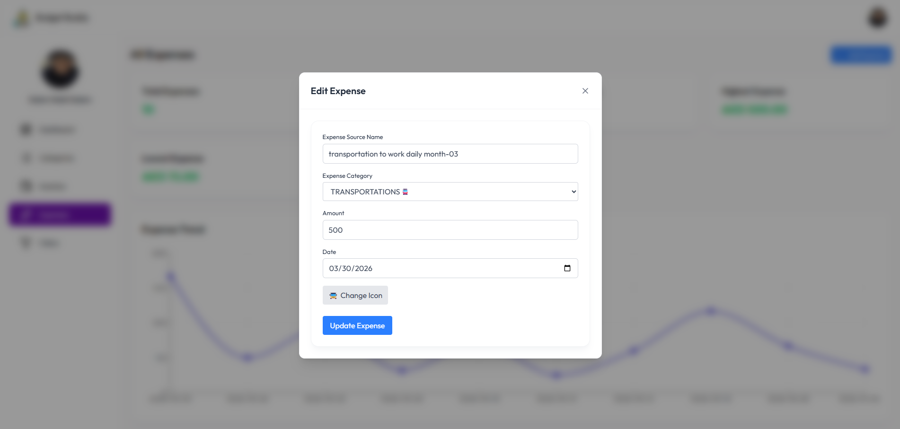
</p>
<p align="center">
  <sub>Update existing expense form for transaction maintenance.</sub>
</p>

### Filters

<p align="center">
  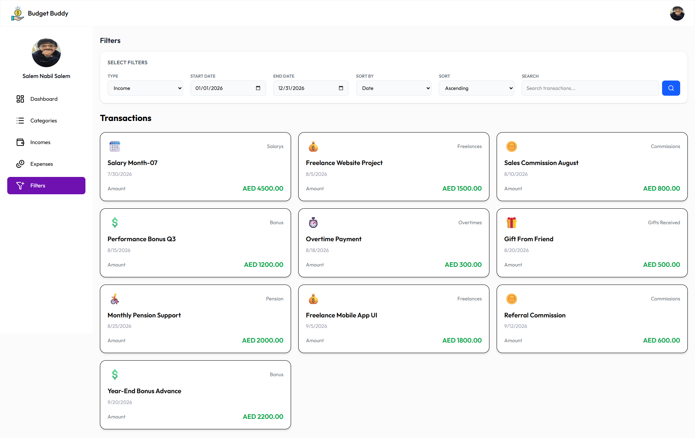
</p>
<p align="center">
  <sub>Filtering interface to quickly find relevant financial records.</sub>
</p>

## Configuration Options

The application uses environment variables for configurable settings, primarily defined in the `.env` file at the project root.

*   `VITE_APP_API_BASE_URL`: **(Required)** This variable defines the base URL of your Budget Buddy backend API. Without this, the frontend will not be able to communicate with the server.

    ```dotenv
    # Example .env configuration
    VITE_APP_API_BASE_URL="http://localhost:5000/api"
    # Or for a deployed backend:
    # VITE_APP_API_BASE_URL="https://api.yourbudgetbuddy.com/api"
    ```

## Project Structure

The project follows a standard React application structure, organized for clarity and maintainability:

```
├── .env.example              # Example environment variables
├── .gitignore                # Files and directories to ignore in Git
├── README.md                 # Project README file
├── index.html                # Main HTML entry point
├── package-lock.json         # Records exact dependency versions
├── package.json              # Project metadata and scripts
└── src/                      # Source code directory
    ├── App.css               # Global application styles
    ├── App.jsx               # Main application component
    └── assets/               # Static assets (images, icons, etc.)
        ├── images.js         # Centralized image imports/exports
        ├── login-bg.png      # Background image for login
        ├── logo.png          # Budget Buddy application logo
        ├── sidebar.js        # Sidebar specific assets/data (e.g., menu items)
        └── components/       # Reusable UI components
            ├── ProfilePhotoUpload.jsx   # Component for uploading profile photos
            ├── TransactionInfoCard.jsx  # Component to display transaction details
            └── category/                # Components specific to category management
                ├── AddCategoryForm.jsx  # Form for adding new categories
                └── ... (other category components)
```

## Contributing Guidelines

We welcome contributions to the Budget Buddy Frontend! If you're interested in helping improve the application, please follow these steps:

1.  **Fork the Repository:** Start by forking the `budget-buddy-application-frontend` repository to your GitHub account.
2.  **Clone Your Fork:** Clone your forked repository to your local machine:
    ```bash
    git clone https://github.com/YourUsername/budget-buddy-application-frontend.git
    cd budget-buddy-application-frontend
    ```
3.  **Create a New Branch:** Create a dedicated branch for your feature or bug fix:
    ```bash
    git checkout -b feature/your-feature-name
    # or for a bug fix:
    # git checkout -b bugfix/issue-description
    ```
4.  **Make Your Changes:** Implement your feature or fix the bug.
5.  **Run Linting:** Ensure your code adheres to the project's style guidelines by running ESLint:
    ```bash
    npm run lint
    ```
    Address any reported issues.
6.  **Commit Your Changes:** Write clear and concise commit messages. We encourage following [Conventional Commits](https://www.conventionalcommits.org/en/v1.0.0/):
    ```bash
    git commit -m "feat: Add new feature for expense categorization"
    # or
    # git commit -m "fix: Resolve styling issue on transaction card"
    ```
7.  **Push to Your Branch:** Push your changes to your forked repository:
    ```bash
    git push origin feature/your-feature-name
    ```
8.  **Open a Pull Request (PR):**
    *   Go to the original `budget-buddy-application-frontend` repository on GitHub.
    *   You should see an option to "Compare & pull request" from your branch.
    *   Provide a detailed description of your changes, their purpose, and any relevant screenshots or steps to reproduce the issue (if it's a bug fix).
    *   Reference any related issues using keywords like `Fixes #123` or `Closes #456`.

## License Information

This project is currently **not licensed**.

This means that by default, all rights are reserved, and you may not use, distribute, or modify this software without explicit permission from the copyright holder (SalemNabeelSalem).

It is highly recommended for the project owner to choose and add a license (e.g., MIT, Apache 2.0, GPL) to clarify the terms under which this software can be used, distributed, and contributed to by others.

## Acknowledgments

*   Built with [React](https://react.dev/)
*   Developed using [Vite](https://vitejs.dev/)
*   Styled with the power of [Tailwind CSS](https://tailwindcss.com/)
*   Development environment provided by [Node.js](https://nodejs.org/)
*   Code quality maintained with [ESLint](https://eslint.org/)
*   Special thanks to the open-source community for the invaluable tools and libraries used in this project.